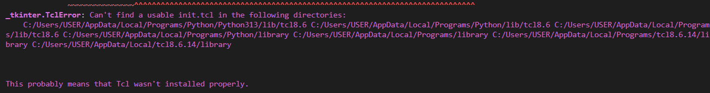

# Procesos II. Trabajo final

## Ejecutar el programa

Nuestro programa se puede ejecutar en Windows o en Linux/MacOS. Solo necesitas Python instalado (versión >=3.9) con el complemento Tkinter para poder generar las gráficas.

### En Windows

```bash
python -m venv venv  # instalar entorno virtual (solo una vez)
.\venv\Scripts\activate  # activar el entorno virtual
python install -r requirements.txt  # instalar librerías (solo una vez)
python main.py  # ejecutar el programa
```

### En Linux/MacOS

```bash
python3 -m venv venv  # instalar entorno virtual (solo una vez)
source venv/bin/activate  # activar el entorno virtual
python install -r requirements.txt  # instalar librerías (solo una vez)
python main.py  # ejecutar el programa
```

### Problemas con Tkinter

Si no instalaste Tkinter junto con Python, verás un error como este:



La solución es volver a instalar Python, pero incluyendo el paquete de Tkinter seleccionando la casilla correspondiente en el instalador.

Para verificar que tienes correctamente instalado Tkinter, puedes ejecutar `python -m tkinter` en Windows o `python3 -m tkinter` en Linux/MacOS. Si no sale error, está bien instalado.

## Controlar el programa

Podemos ajustar el número de etapas añadiendo el flag `-n` al comando de ejecución:

```bash
python main.py -n <número de etapas>
```
